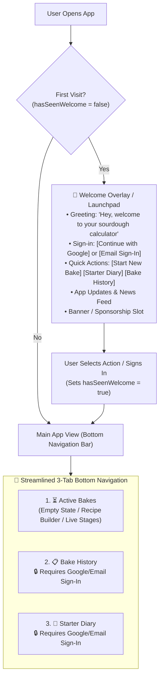

# 🍞 Sourdough Calculator
## Unified Master Product Specification & Architecture (Single Source of Truth)

---

## 1. Executive Summary & Vision

**Sourdough Calculator** is a modern, mobile-first Progressive Web App (PWA) designed for artisanal sourdough bakers. It provides an intuitive, kitchen-tested workflow to eliminate calculation errors, fermentation guesswork, forgotten stretch-and-folds, and starter feeding tracking.

### Key Value Pillars
1. **Welcome & Onboarding Launchpad**: First-time user greeting, Google & Email authentication, rapid action launchpad, release updates feed, and modular sponsor/banner placement.
2. **Feature Access Tiers (Lead Generation & Cloud Sync)**:
   - **Public Access (No Sign-In Required)**: 🍞 **New Bake** (Recipe Builder) & ⏳ **Active Bakes** (Live Timers).
   - **Gated Features (Sign-In Required with Google / Email)**: 📋 **Bake History** (Cloud Bake Journal) & 🫙 **Starter Diary** (Custom Named Starters & Feeding Logs).
3. **Bottom Tab Navigation (Streamlined 3-Tab Workflow)**:
   1. ⏳ **Active Bakes** (Integrated bake hub: empty state ➔ recipe builder ➔ multi-stage workflow ➔ live activity timeline)
   2. 📋 **Bake History** *(Sign-in required)* (Historical bake logs, crumb ratings, tasting notes, and recipe cloning)
   3. 🫙 **Starter Diary & Calculator** *(Sign-in required)* (Custom human-named starters, live health/rise status, feeding logs, and ratio calculator)
4. **Kitchen-Proof Hardware Integration**: Screen Wake Lock, Web Audio chimes, haptic feedback, offline PWA caching.
5. **Cloudflare Edge Deployment**: Instant global loading, zero-config CI/CD via GitHub and Cloudflare Pages.

---

## 2. User Journey & Authentication Architecture



---

## 3. Authentication & Feature Gating Model

### 3.1. Sign-In Options (Google OAuth & Email)
* **Google Sign-In**: One-tap OAuth authentication (`Continue with Google`).
* **Email Sign-In**: Enter email address to authenticate / create account.
* **Lead Collection**: Stores user profile (email, name, registration date) to your database/backend (e.g. Supabase, Firebase, Cloudflare D1/KV, or webhook) to collect baker emails for community updates.

### 3.2. Access Control Matrix

| Feature | Unauthenticated (Guest) | Authenticated (Google / Email) |
| :--- | :---: | :---: |
| 🍞 **New Bake (Recipe Calculator)** | ✅ Unlimited Free Access | ✅ Unlimited Free Access |
| ⏳ **Active Bakes (Live Timers & Workflow)** | ✅ Unlimited Free Access | ✅ Unlimited Free Access |
| 📋 **Bake History (Saved Logs & Notes)** | 🔒 Gated (Prompts Sign-In) | ✅ Full Access + Cloud Sync |
| 🫙 **Starter Diary & Named Starters** | 🔒 Gated (Prompts Sign-In) | ✅ Full Access + Multi-Starter Logs |

---

## 4. Screen Specifications & Functional Requirements

### 4.1. 🎉 Welcome & Launchpad Screen (First Visit Overlay)
* **Display Condition**: Renders on initial visit when `localStorage.getItem("sourdough_has_seen_welcome")` is not `true`.
* **Dismissal**: Selecting any action saves `sourdough_has_seen_welcome = "true"` and routes to the selected tab.
* **Sections**:
  1. **Greeting**: *"Hey, welcome to the sourdough calculator"*
  2. **Sign-In Callout**: `[ 🌐 Continue with Google ]` or email input to unlock cloud sync.
  3. **Action Cards**:
     - `[ 🍞 Start a New Bake ]` (Free)
     - `[ ⏳ View Active Bakes ]` (Free)
     - `[ 📋 Bake History Log ]` *(Sign-in to unlock)*
     - `[ 🫙 Starter Diary & Calculator ]` *(Sign-in to unlock)*
  4. **📢 What's New & Updates**: Changelog bullets / baking tips.
  5. **📢 Banner Slot**: Configurable sponsor / promo banner container.

---

### 4.2. ⏳ Tab 1: Active Bakes (Kitchen Workflow & Live Timers)
* **Landing Behavior**: Default active tab on regular app launch.
* **Badge Counter**: Bottom tab displays a counter badge of current in-progress bakes.
* **Empty State**: Friendly card with `[ ➕ Start a New Bake ]` button that switches to Tab 3.
* **Flexible Stage Progression Engine (No Locked Flow)**:
  - Bakers are **never trapped or locked** in a rigid stage.
  - At any moment, the user can start, pause, reset, or add extra time (`+15m`, `+30m`, or custom duration) if a step needs more development (e.g. flour needs more autolyse rest).
  - **Stage Completion Prompt**: When any stage timer reaches 0:
    - Synthesizes audio chime + haptic vibration.
    - Card displays a completion dialog: *"Autolyse finished. Ready for the next stage?"*
    - Two clear actions:
      1. `[ + Add Time / Extra Timer ]` (adds more rest time to the current stage).
      2. `[ Advance to Stage 2: Stretch & Folds → ]` (transitions smoothly to the next phase).
  - **Manual Stage Navigation**: Tabs/steppers allow jumping freely between stages (Autolyse $\leftrightarrow$ Stretch & Folds $\leftrightarrow$ Bulk Rise $\leftrightarrow$ Cold Retard $\leftrightarrow$ Bake).
* **Live Step Activity Log / Kitchen Timeline (Bottom of Active Bake Card)**:
  - Renders a clean, chronological list of every action taken so far during this bake session:
    - `08:00 AM` — *Autolyse started (30m)*
    - `08:30 AM` — *Autolyse extended (+15m)*
    - `08:45 AM` — *Autolyse completed ✓*
    - `09:15 AM` — *Stretch & Fold 1/4 completed ✓*
    - `09:45 AM` — *Stretch & Fold 2/4 completed ✓*
    - `10:15 AM` — *Stretch & Fold 3/4 completed ✓*
    - `10:45 AM` — *Stretch & Fold 4/4 completed ✓*
    - `11:00 AM` — *Bulk fermentation started (8h estimated @ 23°C)*
  - Eliminates kitchen memory fatigue (*"Did I already do 3 folds or 4?"*).
  - Automatically saved with the session and archived into **Bake History** upon completion.
* **Hardware Integration**: Screen Wake Lock toggle button on top bar, Web Audio chimes, and haptic vibration (`navigator.vibrate`).
* **Session Actions**: `✅ Mark Complete` (saves snapshot & timeline to History) | `🗄 Archive`.

---

### 4.3. 📋 Tab 2: Bake History & Journal (Gated)
* **Auth Guard**: If the user is not signed in, renders an engaging Unlock Screen:
  - *"Unlock Your Cloud Bake History"*
  - Benefits: Save crumb ratings, keep tasting notes, clone past successful recipes, multi-device cloud backup.
  - Buttons: `[ 🌐 Sign In with Google ]` | `[ ✉️ Sign In with Email ]`.
* **Authenticated Features**:
  - Filterable list: Filter by "All", "Completed", "Archived".
  - Metadata: Date/time, loaf count, total flour, hydration %, salt %, ambient temperature.
  - Detail & Rating: Crumb openness rating (1 to 5 ⭐), crust blistering rating, tasting notes.
  - "Clone to New Bake" button.

---

### 4.4. 🍞 Tab 3: New Bake (Recipe Calculator & Flour Blends)
* **Starter / Levain Selection Logic**:
  - **Guest / Non-Logged-In Default & Member Notice**:
    - If the user is not signed in, the system **defaults directly to standard Manual Input fields**:
      - Starter Flour input `[ 50 ] g`
      - Starter Water input `[ 50 ] g`
    - Displays a subtle warm warning / callout badge above the inputs:
      > ℹ️ *Starter Diary Sync is a member feature. Sign in to link your saved starters, or enter your flour/water amounts manually below.*
    - Non-logged-in users experience zero friction and can immediately calculate and bake with manual values.
  - **Authenticated / Logged-In Mode**:
    - The dropdown selector is unlocked, listing all active named starters from their personal diary (e.g. `Doughlene (100% Rye · 🟢 At Peak)`, `Sammy (White Levain)`).
    - Selecting a named starter auto-fills the starter flour and water ratios and binds the session to that starter.
    - Selecting `Manual Input` returns to editable input fields.
* **Recipe Parameters**:
  - Total Flour Target ($tf$) in grams.
  - Loaf Count ($n$) with quick steppers.
  - Target Hydration ($hyd\%$).
  - Salt Percentage ($sp\%$).
  - Starter / Levain Inoculation Percentage ($20\%$ default, customizable).
* **Live Baker's Formula Table (Itemized Ingredient Breakdown)**:
  - Decomposes the dough into explicit, individual weighing rows for the mixing bowl:
    - **Each Flour Variety** (e.g. *Bread Flour (80%)*: `360g` · `72.0%`, *Whole Wheat (20%)*: `90g` · `18.0%`)
    - **Starter Flour / Levain Flour**: `50g` · `10.0%`
    - **Main Water**: `325g` · `65.0%`
    - **Starter Water / Levain Water**: `50g` · `10.0%`
    - **Salt**: `10g` · `2.0%`
    - ─── **Total Dough**: `885g` · `177.0%` ─── (Rendered in the edge-to-edge Terracotta Totals Bar).
  - Scaled by loaf count ($n$) so bakers know the exact gram weights to measure on their kitchen scale.

---

### 4.5. 🫙 Tab 4: Starter Diary & Calculator (Gated)
* **Auth Guard**: If the user is not signed in, renders an engaging Unlock Screen:
  - *"Unlock Your Named Starter Diary"*
  - Benefits: Give your sourdough starters custom human names, track feeding schedules, calculate custom ratios, get peak rise alerts.
  - Buttons: `[ 🌐 Sign In with Google ]` | `[ ✉️ Sign In with Email ]`.
* **Authenticated Features**:
  - **Named Starter Profiles**: Create and manage multiple starters (e.g. *"Doughlene"*, *"Bread Pitt"*, *"Sammy"*).
  - **Live Status & Health**: 🟢 Active & at peak / ⏳ Rising / 🟡 Hungry / ❄️ Refrigerated.
  - **Top-Right `[ ➕ Log Feed ]` Button**: Log seed starter (g), flour (g), water (g), auto-calculates feeding ratio (`1:2:2`), aroma/rise notes, and restarts rise timer.
  - **Target Levain Calculator**: Calculate exact seed, flour, and water needed for any recipe batch.

---

### 4.6. 📱 Bottom Tab Navigation Bar (Active-First Layout)

Fixed to the viewport bottom with iOS `safe-area-inset-bottom` padding:
1. ⏳ **Active Bakes**
2. 📋 **Bake History** 🔒
3. 🍞 **New Bake**
4. 🫙 **Starter Diary** 🔒

---

## 5. Baker's Mathematical Engine & Formulas

### 5.1. Core Recipe Equations
$$\text{Total Water } (g) = \left\lfloor \frac{tf \times hyd}{100} + 0.5 \right\rfloor$$

$$\text{Total Salt } (g) = \left\lfloor \frac{tf \times sp}{100} + 0.5 \right\rfloor$$

$$\text{Main Flour } (g) = \left\lfloor (tf - sf) + 0.5 \right\rfloor$$

$$\text{Main Water } (g) = \left\lfloor (\text{Total Water} - sw) + 0.5 \right\rfloor$$

$$\text{Total Dough Weight } (g) = tf + \text{Total Water} + \text{Total Salt}$$

### 5.2. Target Levain Formulas
Given target levain weight $W$ and ratio $R_{\text{seed}} : R_{\text{flour}} : R_{\text{water}}$:
$$\text{Total Parts} = R_{\text{seed}} + R_{\text{flour}} + R_{\text{water}}$$
$$\text{Seed Starter (g)} = \text{round}\left(W \times \frac{R_{\text{seed}}}{\text{Total Parts}}\right)$$
$$\text{Flour (g)} = \text{round}\left(W \times \frac{R_{\text{flour}}}{\text{Total Parts}}\right)$$
$$\text{Water (g)} = \text{round}\left(W \times \frac{R_{\text{water}}}{\text{Total Parts}}\right)$$

---

## 6. Fermentation Science & Temperature Matrix

| Temperature ($^\circ\text{C}$) | Est. Bulk Time (Hours) | Target Rise (\%) |
| :---: | :---: | :---: |
| **27.0** | 5.5 hrs | 30% |
| **26.0** | 5.5 hrs | 30% |
| **25.5** | 6.0 hrs | 40% |
| **25.0** | 6.0 hrs | 40% |
| **24.5** | 7.0 hrs | 50% |
| **24.0** | 7.0 hrs | 50% |
| **23.0** | 8.0 hrs | 55% |
| **22.5** | 9.0 hrs | 60% |
| **22.0** | 10.0 hrs | 65% |
| **21.5** | 11.0 hrs | 70% |
| **21.0** | 12.0 hrs | 75% |
| **20.5** | 13.0 hrs | 80% |
| **20.0** | 14.0 hrs | 85% |
| **19.5** | 15.0 hrs | 90% |
| **19.0** | 16.0 hrs | 95% |
| **18.0** | 16.0 hrs | 100% |

---

## 7. State Schema & Persistence Contracts

```typescript
interface UserProfile {
  id: string;
  email: string;
  name?: string;
  avatarUrl?: string;
  signedInAt: number;
}

interface StarterFeedEntry {
  id: string;
  timestamp: number;
  dateStr: string;
  timeStr: string;
  seedGrams: number;
  flourGrams: number;
  flourType: string;
  waterGrams: number;
  waterTemp?: string;
  ratio: string; // e.g. "1:2:2"
  notes?: string;
}

interface StarterProfile {
  id: string;
  name: string; // e.g. "Doughlene", "Sammy"
  flourType: string;
  dateCreated: string;
  status: "active_peak" | "rising" | "hungry" | "refrigerated";
  lastFedTimestamp: number | null;
  peakTargetTimestamp: number | null;
  feedHistory: StarterFeedEntry[];
}

interface BakeSession {
  id: number;
  date: string;
  time: string;
  status: "active" | "completed" | "archived";
  starterId?: string;
  starterName?: string;
  totalFlour: number;
  hydration: number;
  saltPct: number;
  loaves: number;
  flourBlend?: { name: string; percentage: number; grams: number }[];
  crumbRating?: number; // 1-5
  notes?: string;
}

interface AppState {
  user: UserProfile | null;
  hasSeenWelcome: boolean;
  activeTab: "active_bakes" | "history" | "new_bake" | "starter_calc";
  wakeLockActive: boolean;
  activeSessions: BakeSession[];
  historySessions: BakeSession[];
  starters: StarterProfile[];
  selectedStarterId: string | null;
}
```

---

## 8. Technology Stack & Cloudflare Hosting

* **Framework**: React + TypeScript + Vite
* **Authentication**: Google OAuth + Email Sign-In (Firebase Auth / Supabase / Cloudflare Workers API)
* **Styling**: Tailwind CSS + Lucide React Icons
* **PWA Plugin**: `vite-plugin-pwa` with Workbox offline caching
* **Hosting**: GitHub Repository + Cloudflare Pages (Instant global edge CDN, automated CI/CD on git push)
